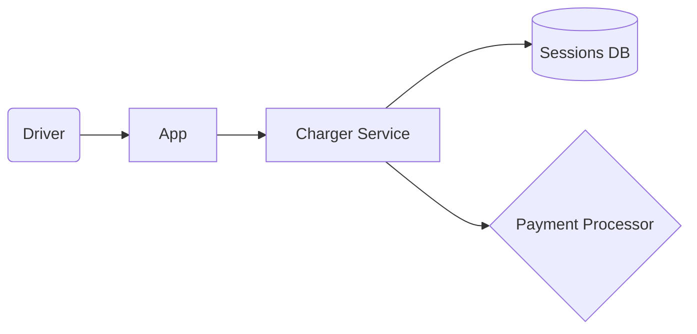

# Mermaid diagram guide

Conventions for the before/after architecture diagrams emitted by `scripts/report_render.py`. Mermaid is chosen because it renders inline in GitHub, GitLab, and most modern Markdown viewers without extra tooling.

## Diagram types

Two Mermaid files per run:

| File | Type | Purpose |
|---|---|---|
| `architecture_before.mmd` | `flowchart LR` | The naive architecture as captured |
| `architecture_after.mmd` | `flowchart LR` | The naive architecture with residue overlays + contagion legend |

Both are saved to disk and referenced from `report.md` via the standard `\`\`\`mermaid` fenced-block include.

## Node naming

- Use the component `id` (e.g. `C01`) as the Mermaid node id.
- Render the component `name` as the node label.
- Choose the node *shape* by `kind`:
  - `service`     → `[ ]`     rectangle
  - `datastore`   → `[( )]`   cylinder
  - `queue`       → `>[ ]`    asymmetric
  - `client`      → `( )`     rounded
  - `external`    → `{ }`     rhombus
  - `human`       → `(( ))`   double-circle
  - `device`      → `[/ /]`   parallelogram
  - `edge`        → `{{ }}`   hexagon

Example:


## Edge styling

- `sync`   → `-->`   solid arrow
- `async`  → `-.->`  dotted
- `data`   → `==>`   thick
- `human`  → `--o`   open circle (originating from a human node)
- `device` → `--x`   x-end (physical actuation)

Edge labels are short — the verb of the interaction ("authenticates", "bills", "unlocks").

## Residue overlays (after-diagram only)

Residues are drawn as **classDef** overlays — they don't add new nodes; they *annotate* existing components and edges with which residue protects them.

Define classes once at the top of the after-diagram:

```
classDef residue fill:#e8f5e9,stroke:#2e7d32,stroke-width:2px,color:#1b5e20;
classDef hotspot fill:#fff3e0,stroke:#e65100,stroke-width:3px,color:#bf360c;
classDef brittle stroke:#c62828,stroke-width:2px,stroke-dasharray:4 2;
```

Then:

- Components touched by ≥1 residue get `class C03 residue`.
- Components in the `hotspots[]` list get `class C03 hotspot` (overrides residue colour to make them stand out).
- Edges in the top entry of `brittleness_rank` get `class edgeId brittle` and a label like `|⚠ contagion|`.

Below the diagram, add a Mermaid `subgraph` legend or a Markdown bullet list mapping each component to the residues that touch it:

```
- C03 (Charger Service): circuit_breaker_fallback_cache, charge_session_observability
- C05 (Payment Processor): outbox_with_async_reconciliation, idempotent_replay
```

## Contagion edges

Residue→residue couplings with `weight ≥ 0.5` are drawn as **dashed red edges between the components those residues touch**, not between residue boxes (because residues aren't nodes).

If a single coupling connects more than 2 components (e.g. one residue spans 3 components), draw the edge between the most-loaded component pair from each residue.

## Layout

Always `flowchart LR` (left-to-right) — top-to-bottom (`TD`) is reserved for nested subgraphs only. Group components by subgraph if the user provided logical groupings (`subgraph "Edge Devices"`, `subgraph "Cloud"`).

## Worst-case fallback

If the architecture has > 25 components and the diagram is unreadable, `report_render.py` emits a *summary* diagram with one node per `subgraph` and a footnote noting the component count. The full mermaid is still saved as `architecture_full.mmd` for any user willing to render it offline.
